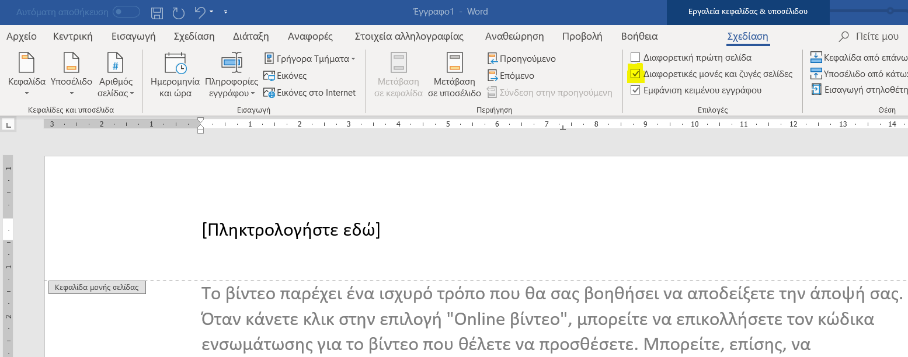

[<--](main.md)

# Επεξεργασία κειμένου στο Word
## Σύντομες οδηγίες από την
## Άννυ και τη Γιώτα

Σκοπός μας είναι να δημιουργήσουμε μία εργασία στο Word η οποία θα πρέπει να έχει συγκεκριμένες προδιαγραφές. Ξεκινάμε λοιπόν ανοίγοντας το πρόγραμμα Microsoft Word (Office 365) και επιλέγουμε "Κενό Έγγραφο". Στο κενό έγγραφο που εμφανίζεται στην οθόνη, δεν γράφουμε απολύτως τίποτα.

Από το μενού "Αρχείο" επιλέγουμε "Αποθήκευση ως" και διαλέγουμε έναν φάκελο όπου θα αποθηκεύσουμε το κενό έγγραφο, δίνοντας ένα χαρακτηριστικό όνομα στο έγγραφο ώστε να το βρίσκουμε εύκολα όποτε το χρειαζόμαστε.

Το έγγραφο που θα ετοιμάσουμε θα πρέπει να έχει συγκεκριμένες προδιαγραφές στα ακόλουθα:

1. Διάταξη Σελίδας
2. Γραμματοσειρά
3. Παράγραφοι
4. Περιεχόμενο Κειμένου
5. Ενότητες και Επικεφαλίδες Ενοτήτων
6. Εικόνες και Λεζάντες Εικόνων
7. Κεφαλίδες και Υποσέλιδα
8. Περιεχόμενα και Εξώφυλλο

Αρχικά, θα ξεκινήσουμε κάνοντας τις ρυθμίσεις στο κενό έγγραφο για τα 1, 2 και 3. Αφού ολοκληρώσουμε αυτές τις ρυθμίσεις, τότε θα μπορούμε να γράψουμε, ή να αντιγράψουμε, κείμενο στο έγγραφο μας και θα έχει αυτόματα τη μορφοποίηση που θέλουμε.

Αν δεν κάνουμε όμως αυτές τις ρυθμίσεις στην αρχή, τότε κάθε φορά που γράφουμε, ή αντιγράφουμε κείμενο, θα πρέπει να το επιλέγουμε και να κάνουμε ξανά και ξανά τη σωστή μορφοποίηση.

Ξεκινάμε λοιπόν με την "Διάταξη Σελίδας" ή αλλιώς την "Διαμόρφωση Σελίδας" όπως ονομάζεται σε αυτή την έκδοση του Word.

## Διάταξη Σελίδας

* Μέγεθος σελίδας: Α4

* Περιθώρια σελίδας:
   * Επάνω 2,4 εκ.
   * Κάτω 2,4 εκ.
   * Αριστερά 3 εκ.
   * Δεξιά 3εκ.

Για να ρυθμίσουμε το μέγεθος της σελίδας, πηγαίνουμε στην επιλογή "Διάταξη" και πατάμε το εικονίδιο "Μέγεθος". Όπως φαίνεται στο επόμενο screen-shot, το μέγεθος σελίδας Α4 ήταν ήδη επιλεγμένο.

Έπειτα, πάλι στην επιλογή "Διάταξη", κάνουμε κλικ στο εικονίδιο "Περιθώρια" και επειδή τα περιθώρια που θέλουμε δεν υπάρχουν στη λίστα που εμφανίζεται, επιλέγουμε "Προσαρμοσμένα περιθώρια"

Στο παράθυρο που εμφανίζεται, ρυθμίζουμε τα σωστά περιθώρια. Προσοχή μόνο στις υποδιαστολές. Πρέπει να γραφτούν με κόμμα και όχι με τελεία (το αριθμητικό πληκτρολόγιο βγάζει τελεία αντί για υποδιαστολή όταν είναι επιλεγμένο το Αγγλικό πληκτρολόγιο)

## Γραμματοσειρά

* Times New Roman
* Μέγεθος γραμματοσειράς: 12 στιγμές

Θα πρέπει επίσης μέσα στο κείμενο να γίνει χρήση
* Έντονων γραμμάτων
* Πλάγιων γραμμάτων
* Υπογραμμισμένων γραμμάτων

Πηγαίνουμε στην επιλογή "Κεντρική" και βλέπουμε ότι υπάρχει ένα τμήμα της γραμμής των εργαλείων που γράφει "Γραμματοσειρά", κάτω ακριβώς από τα εικονίδια. Δεξιά από αυτό το σημείο, υπάρχει ένα μικρό βελάκι (φαίνεται με κίτρινο στο screen-shot) και πατώντας το εμφανίζεται το πλήρες μενού με όλες τις επιλογές για την "Γραμματοσειρά"

Στο παράθυρο που εμφανίζεται, ρυθμίζουμε τη σωστή γραμματοσειρά και το σωστό μέγεθος των γραμμάτων.

## Παράγραφοι

* Πλήρης στοίχιση
* Εσοχή πρώτης γραμμής 1,2 εκ.
* Διάστημα από επόμενη 12 στιγμές
* Διάστιχο πολλαπλό 1,2

Η απόσταση μεταξύ των παραγράφων θα πρέπει να ρυθμίζεται αποκλειστικά από αυτές τις επιλογές
* Δεν επιτρέπονται κενές παράγραφοι

Πηγαίνουμε πάλι στην επιλογή "Κεντρική" και όπως και στην "Γραμματοσειρά", έτσι και στην "Παράγραφο" υπάρχει ένα μικρό βελάκι κάτω δεξιά από τα εικονίδια, ακριβώς δίπλα στο το σημείο που γράφει "Παράγραφος"

Στο παράθυρο που θα εμφανιστεί, ρυθμίζουμε τις σωστές επιλογές για τις παραγράφους.

Προσοχή και πάλι στα δεκαδικά νούμερα. Όσα δεν μπορούμε να τα ρυθμίσουμε με τα βελάκια που έχουν δίπλα τους, θα πρέπει να τα γράψουμε με υποδιαστολή κι όχι με τελεία

> **Σε αυτό το σημείο ολοκληρώσαμε όλες τις απαραίτητες ρυθμίσεις για την _Διάταξη της σελίδας_, την _Γραμματοσειρά_ και την _Παράγραφο_ και μπορούμε τώρα να ξεκινήσουμε να γράφουμε ή να αντιγράφουμε κείμενο**

## Περιεχόμενο Κειμένου

* Ελεύθερο θέμα
* Τουλάχιστον 5 σελίδες κειμένου
* Αντιγραφή του κειμένου από το Internet
* Αφαίρεση των περίεργων κρυφών χαρακτήρων

Εδώ ξεκινάμε να γράφουμε το κείμενο ή επιλέγουμε δύο κείμενα από το Internet (ένα κείμενο για κάθε ενότητα). Για να αντιγράψουμε κείμενο από το Internet, επιλέγουμε το κείμενο και πατάμε δεξί κλικ στο ποντίκι. Από το μενού που εμφανίζεται, επιλέγουμε αντιγραφή.

Έπειτα, πηγαίνουμε στο Word και πατάμε δεξί πλήκτρο στο σημείο του εγγράφου που θέλουμε να κάνουμε επικόλληση. Βλέπουμε ότι υπάρχουν διάφορες "Επιλογές επικόλλησης". Εμείς επιλέγουμε το εικονίδιο που είναι τέρμα δεξιά (Διατήρηση μόνο κειμένου) ώστε να κάνουμε επικόλληση μόνο το κείμενο χωρίς τους περίεργους κρυφούς χαρακτήρες.

Επίσης, πατάμε το εικονίδιο με το σύμβολο της παραγράφου, το οποίο βρίσκεται μαζί με τα υπόλοιπα εικονίδια των ρυθμίσεων "Παράγραφος" για να μας δείξει τους κρυφούς χαρακτήρες που υπάρχουν στο κείμενο μας. Για παράδειγμα, μπορεί κάπου να υπάρχουν πολλά σύμβολα της παραγράφου μαζί και θα πρέπει να τα σβήσουμε γιατί δεν πρέπει να έχουμε κενές παραγράφους.

## Ενότητες και Επικεφαλίδες Ενοτήτων

* Τουλάχιστον 2 ενότητες
* Τουλάχιστον 2 σελίδες ανά ενότητα
* Επικεφαλίδα 1 για τις τους τίτλους των ενοτήτων

Για να προσθέσουμε ενότητες στο κείμενο, πηγαίνουμε ακριβώς στο σημείο όπου θέλουμε να ξεκινάει μία καινούργια ενότητα και τοποθετούμε σε εκείνο ακριβώς το σημείο τον δρομέα του Word.

Για παράδειγμα, εάν θέλουμε η καινούργια ενότητα να ξεκινάει στο σημείο που έχουμε γράψει τον τίτλο που θέλουμε να έχει η ενότητα αυτή, τότε κάνουμε κλικ και τοποθετούμε τον δρομέα στην αρχή ακριβώς εκείνου του τίτλου. (π.χ. εάν ο τίτλος είναι "Κείμενο του Word", τότε θα κάνουμε κλικ ακριβώς αριστερά από το γράμμα Κ ώστε η καινούργια ενότητα να ξεκινάει από αυτό το σημείο). Στη συνέχεια, από την επιλογή "Διάταξη" κάνουμε κλικ στο "Αλλαγές" και στο μενού που εμφανίζεται επιλέγουμε "Αλλαγές ενοτήτων", "Επόμενη σελίδα".

Με τον ίδιο τρόπο ορίζουμε όλες τις ενότητες που έχουμε στο έγγραφο μας. Εάν έχουμε για παράδειγμα δύο κείμενα και το ένα θέλουμε να έχει επικεφαλίδα με τον τίτλο "Πρώτο κείμενο" ενώ το άλλο να έχει επικεφαλίδα με τον τίτλο "Δεύτερο κείμενο" θα κάνουμε τα εξής:

* Γράφουμε στην αρχή της κάθε ενότητας τον τίτλο που θέλουμε να έχει. Δηλαδή _Πρώτο κείμενο_ και _Δεύτερο κείμενο_. Χρησιμοποιούμε απλό κείμενο, χωρίς να το μορφοποιήσουμε με μεγάλα γράμματα και χρώματα.

* Τοποθετούμε τώρα τον δρομέα του Word αμέσως πριν το γράμμα "Π" και εισάγουμε μία αλλαγή ενότητας. Πάντοτε επιλέγουμε "Αλλαγή ενότητας", "Επόμενη σελίδα"

* Έπειτα τοποθετούμε τον δρομέα του Word αμέσως πριν το γράμμα "Δ" και εισάγουμε μία αλλαγή ενότητας. Και πάλι επιλέγουμε "Αλλαγή ενότητας", "Επόμενη σελίδα"

Με αυτό τον τρόπο έχουμε δημιουργήσει ένα αρχείο Word με Τρεις ενότητες. Μία ενότητα από την αρχή του εγγράφου μέχρι το σημείο που αρχίζει το "Πρώτο κείμενο", μία δεύτερη ενότητα που ξεκινάει από το σημείο που αρχίζει το "Πρώτο κείμενο" μέχρι το σημείο που τελειώνει, και μία τρίτη ενότητα που ξεκινάει από το σημείο που αρχίζει το "Δεύτερο κείμενο" και φτάνει μέχρι το τέλος ολόκληρου του εγγράφου.

>Καλό είναι πριν αρχίσουμε να εισάγουμε ενότητες στο έγγραφο μας να πατήσουμε 2-3 φορές το enter στην αρχή του εγγράφου ώστε αργότερα να μπορούμε να προσθέσουμε εύκολα κείμενο ή τα περιέχομενα σε εκείνο το σημείο.

Εάν έτσι προσθέσουμε κάποιες κενές γραμμές στο έγγραφο, μπορούμε να το ελέγξουμε αργότερα και να τις διαγράψουμε στο τέλος.

>Επίσης, είναι χρήσιμο να πατήσουμε το σύμβολο της παραγράφου ώστε να βλέπουμε τους κρυφούς χαρακτήρες του έγγραφου και έτσι να ξέρουμε που έχουμε αλλαγές ενοτήτων.

**Τώρα μένει να απλά βάλουμε τις επικεφαλίδες στις ενότητες μας:**

Εδώ απλά επιλέγουμε το κείμενο που θέλουμε να κάνουμε επικεφαλίδα και έπειτα από τις επιλογές "Κεντρική", "Στυλ", επιλέγουμε "Επικεφαλίδα 1". Στη συνέχεια, εάν θέλουμε μπορούμε να αλλάξουμε την μορφοποίηση της επικεφαλίδας επιλέγοντας, για παράδειγμα, μεγαλύτερα γράμματα ή άλλη γραμματοσειρά.

Κάνουμε ακριβώς την ίδια διαδικασία για όλες τις επικεφαλίδες του εγγράφου μας.

## Εικόνες και Λεζάντες Εικόνων

* Εισαγωγή εικόνων σε δική τους παράγραφο
* Στοίχιση εικόνων στο κέντρο
* Εισαγωγή λεζάντας σε κάθε εικόνα

Επιλέγουμε τις εικόνες που θέλουμε να χρησιμοποιήσουμε. Εάν είναι από το Internet, πατάμε δεξί πλήκτρο και επιλέγουμε "Αποθήκευση εικόνας".

Στη συνέχεια, επιλέγουμε το σημείο του εγγράφου μας όπου θέλουμε να εισάγουμε μία εικόνα και από το μενού "Εισαγωγή" πατάμε "Εικόνες".

 Αφού επιλέξουμε την φωτογραφία που θέλουμε και την εισάγουμε στο έγγραφο μας, κάνουμε δεξί κλικ επάνω στην φωτογραφία και επιλέγουμε "Μέγεθος και θέση"

 

 Στο παράθυρο που θα εμφανιστεί, επιλέγουμε την καρτέλα "Αναδίπλωση κειμένου" και διαλέγουμε "Επάνω και κάτω". Έπειτα, αλλάζουμε την ρύθμιση "Απόσταση από το κείμενο" με τις ρυθμίσεις που προτιμάμε.

  

## Κεφαλίδες και Υποσέλιδα

* Μονές σελίδες:
   * Κεφαλίδα: Τίτλος της ενότητας

* Ζυγές σελίδες:
   * Κεφαλίδα: Τίτλος της εργασίας

* Μονές και ζυγές σελίδες:
   * Υποσέλιδο με τους αριθμούς της σελίδας

Για την εισαγωγή κεφαλίδας, πηγαίνουμε στο μενού "Εισαγωγή" και επιλέγουμε "Εισαγωγή κεφαλίδας" και στη συνέχεια διαλέγουμε μία κεφαλίδα που μας αρέσει.

Στη συνέχεια, πρέπει να επιλέξουμε "Διαφορετικές μονές και ζυγές σελίδες"

Ξεκινάμε τώρα να γράφουμε τις κεφαλίδες με την **σειρά**. Δηλαδή πρώτα στην πρώτη ενότητα, έπειτα στη δεύτερη κ.τ.λ.

Γράφουμε πρώτα την κεφαλίδα στην **πρώτη μονή σελίδα** της **πρώτης ενότητας** και έπειτα κάνουμε διπλό κλικ κάπου μέσα στο κείμενο του εγγράφου μας ώστε να κλείσουμε την κεφαλίδα. Η κεφαλίδα αυτή θα εμφανιστεί τώρα αυτόματα σε όλες τις μονές σελίδες ολόκληρου του εγγράφου, δηλαδή όλων των ενοτήτων. Οι ζυγές σελίδες του κειμένου όμως δεν θα έχουν επικεφαλίδα.

Τώρα, εισάγουμε με τον ίδιο τρόπο μία κεφαλίδα στην **πρώτη ζυγή σελίδα** της **πρώτης ενότητας** και αυτόματα θα εμφανιστεί σε όλες τις ζυγές σελίδες όλων των ενοτήτων ολόκληρου του κειμένου.

Στη συνέχεια, χρειάζεται πολύ προσοχή καθώς θα εισάγουμε τις κεφαλίδες στις υπόλοιπες ενότητες, διότι θα πρέπει να ακολουθήσουμε ένα επιπλέον βήμα.

Θα εισάγουμε την κεφαλίδα που θέλουμε στην **πρώτη μονή σελίδα** της **κάθε ενότητας** και έπειτα την κεφαλίδα που θέλουμε στην **πρώτη ζυγή σελίδα** της **κάθε ενότητας**.

**Για να αλλάξουμε όμως μόνο τις κεφαλίδες μιας συγκεκριμένης ενότητας, χωρίς να επηρεάσουμε τις κεφαλίδες στις υπόλοιπες ενότητες, κάθε φορά που ετοιμαζόμαστε να εισάγουμε μία κεφαλίδα θα πρέπει πρώτα να κάνουμε κλικ στην επιλογή "Σύνδεση στην προηγούμενη". Με αυτό τον τρόπο απενεργοποιούμε τη σύνδεση της κεφαλίδας της συγκεκριμένης ενότητας με την κεφαλίδα της προηγούμενης ενότητας. Αν δεν πατήσουμε αυτή την επιλογή, τότε κάθε φορά που αλλάζουμε κεφαλίδα, αυτή θα αλλάζει σε ολόκληρο το κείμενο**

Με την ίδια ακριβώς διαδικασία, εισάγουμε και το υποσέλιδο ή τα υποσέλιδα της επιλογής μιας

## Περιεχόμενα και Εξώφυλλο

* Εισαγωγή Αυτόματου πίνακα περιεχομένων

Εφόσον έχουμε χρησιμοποιήσει "Επικεφαλίδα 1" στους τίτλους των ενοτήτων, η εισαγωγή αυτόματου πίνακα περιεχομένων είναι πολύ εύκολη. Απλά πηγαίνουμε στο σημείο που θέλουμε να εισάγουμε τον πίνακα περιεχομένων και επιλέγουμε από το μενού "Αναφορές", "Πίνακας περιεχομένων".

Στο τέλος, αφού ολοκληρώσουμε το έγγραφο μας, πηγαίνουμε στο σημείο που είναι ο πίνακας περιεχομένων του εγγράφου μας και κάνουμε κλικ στην επάνω αριστερή πλευρά. Στη συνέχεια, επιλέγουμε να κάνουμε ανανέωση του πίνακα για την περίπτωση που έχουν τροποποιηθεί οι αριθμοί των σελίδων ή οι τίτλοι των επικεφαλίδων.

Εισαγωγή έτοιμου εξώφυλλου του Word με:
* Τίτλο
* Υπότιτλο
* Ονοματεπώνυμο
* Ομάδα
* Έτος

Για να εισάγουμε ένα εξώφυλλο στο έγγραφο μας, πηγαίνουμε στο μενού "Εισαγωγή" και επιλέγουμε "Εξώφυλλο". Διαλέγουμε ένα εξώφυλλο που μας αρέσει και στη συνέχεια συμπληρώνουμε τα στοιχεία που θέλουμε.

>Από το μενού "Σχεδίαση" μπορούμε να επιλέξουμε "Σχήματα" για να εισάγουμε ένα επιλέον πλαίσιο κειμένου στο εξώφυλλο (αφού δημιουργήσουμε το σχήμα που θέλουμε, με δεξί κλικ επιλέγουμε "Προσθήκη κειμένου") και έτσι μπορούμε να φτιάξουμε το εξώφυλλο όπως μας αρέσει και με όποια χρώματα θέλουμε.

Κι αν τύχει σε ένα πλαίσιο κειμένου να να μην εμφανίζονται τα γράμματα (τυχαίνει μερικές φορές) τότε πιθανότατα έχει επιλεγεί άσπρο χρώμα για τα γράμματα και για αυτό δεν εμφανίζονται στο άσπρο φόντο...

Κι αυτό ήταν... Έγινε και το εξώφυλλο...

# Συγχαρητήρια!!!

# Η εργασία μόλις ολοκληρώθηκε!!!

[<--](main.md)
